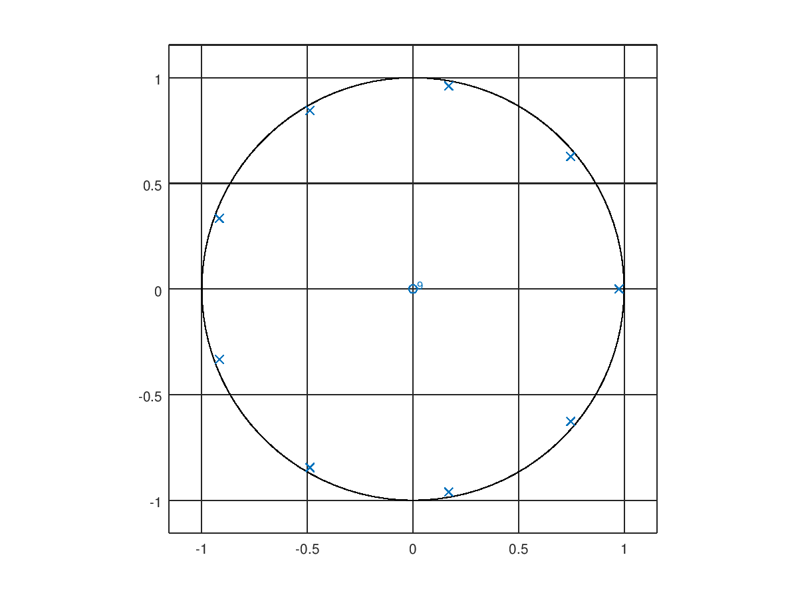

# Ejercicio 1

Dado:

$$
H(z) = \frac{1-\alpha}{1-\alpha z^{-k}}
$$

* Grafique el diagrama de polos y ceros de dicho filtro para α = 0,8 y k = 10

El sistema tendrá $k$ zeros puestos en el origen, dado que para encontrar sus raíces:

$$
H(z) = \frac{z^k (1-\alpha)}{z^k - \alpha}
$$

Asimismo, tendrá $k$ polos distribuidos por la raíz k-ésima de $\alpha$. Estos estarán distribuidos de forma equidistante.

Usando el script de la tarea 3:

# Ejercicio 2

2. Encuentre la ecuación de diferencias equivalente para dicho filtro (para todo $\alpha$ y $k$).

$$
  Y(z) = H(z)X(z)
$$

$$
  Y(z) = \frac{1-\alpha}{1-\alpha z^{-k}}X(z)
$$

$$
  (1-\alpha z^{-k})Y(z) = (1-\alpha)X(z)
$$

$$
  Y(z)-\alpha z^{-k}Y(z) = (1-\alpha)X(z)
$$

$$
  y(n)-\alpha y(n-k) = (1-\alpha)x(n)
$$

Resolviendo:

$$
y(n) = \alpha y(n-k) + (1-\alpha)x(n)
$$
